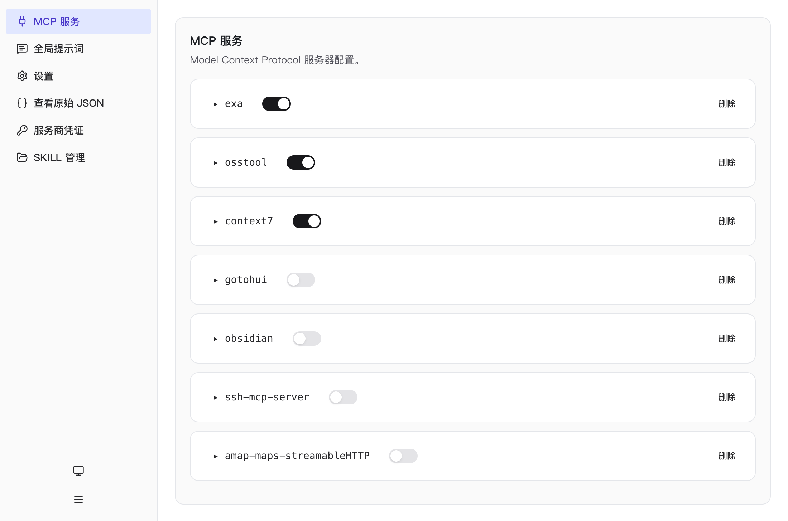
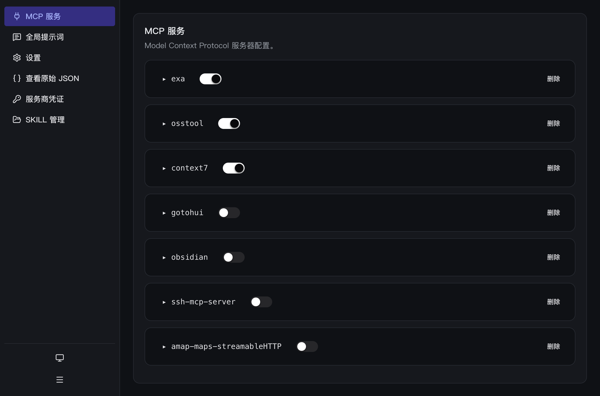

# OCConfiger

opencode 全局配置的可视化编辑器（macOS 桌面应用）。

无需手动编辑 `~/.config/opencode/opencode.jsonc`，在图形界面中完成 MCP 服务、服务商凭证、SKILL、全局提示词与权限的管理。

## 截图

MCP 服务（亮色 / 暗色）：

| 亮色 | 暗色 |
| --- | --- |
|  |  |

SKILL 管理与设置：

| SKILL 管理（亮色） | 设置（暗色） |
| --- | --- |
|  |  |

## 功能

- **MCP 服务**：管理 `mcp` 下的服务器配置，支持展开编辑、启用开关与删除
- **服务商凭证**：管理 `/connect` 已连接的服务商凭证，修改密钥或删除
- **SKILL 管理**：管理 `skills` 目录下的 SKILL，支持新建、实时预览与编辑
- **全局提示词**：编辑 `~/.config/opencode/AGENTS.md`
- **设置**：自动更新开关与全局权限（allow / ask / deny）
- **查看原始 JSON**：只读展示当前完整配置
- 亮色 / 暗色 / 跟随系统主题，离开页面时提示未保存更改

## 安装

从 [Releases](https://github.com/slkxyo/occonfiger/releases) 下载 `OCConfiger-1.0.0.dmg`，打开后拖入「应用程序」。

应用未签名，首次打开请**右键 → 打开**；或在终端执行：

```bash
xattr -dr com.apple.quarantine /Applications/OCConfiger.app
```

## 开发

```bash
pnpm install
pnpm dev        # 启动开发环境
pnpm test       # 运行测试
pnpm typecheck  # 类型检查
pnpm lint       # 代码检查
pnpm build      # 构建
pnpm build:mac  # 打包 macOS 安装包
```

## 技术栈

Electron · React · TypeScript · Chakra UI · zustand · electron-vite · Vitest
